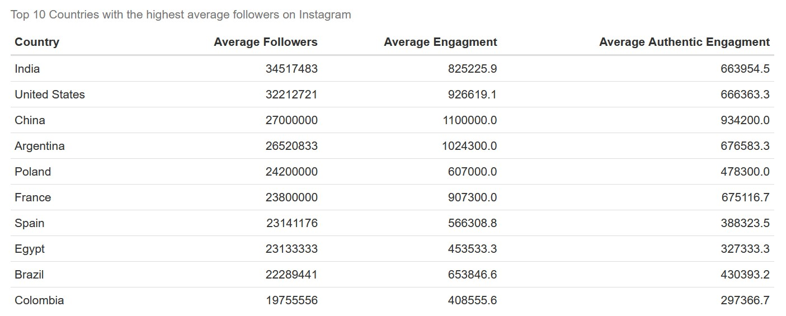
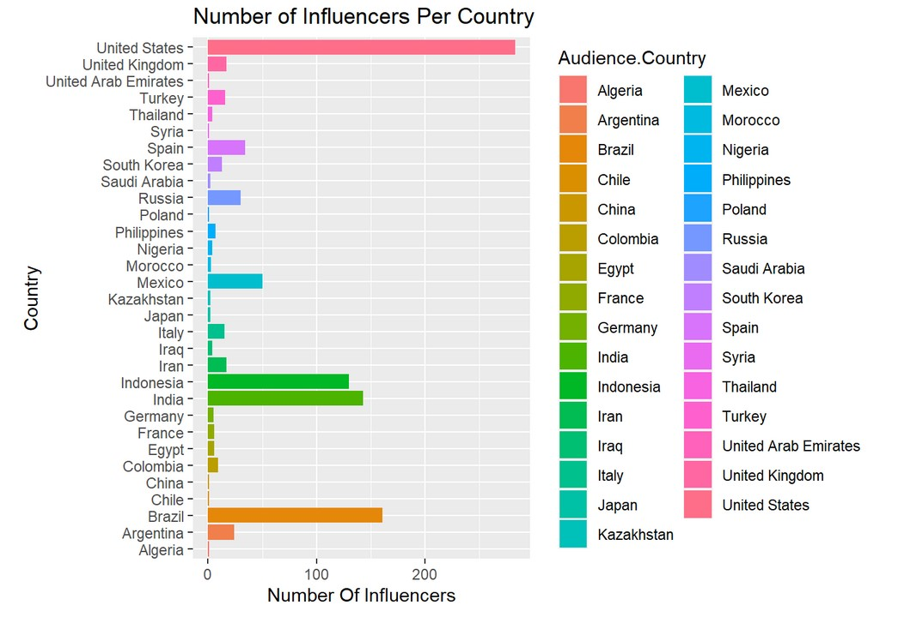

# Title of Your Final Project Here
## INFO 201 "Foundational Skills for Data Science" — Spring 2022

Authors: Coby Williams-Gurian, Kylah Moon, Ella Crowder, Emma Spence

Link: https://emma-spence-18.shinyapps.io/final-project-kylahmoon/

Please create the necessary files for your multi-page Shiny app in this GitHub repository. Consult the Canvas assignment for more details. Be sure to publish your app on Shinyapps.io.

When you are finished, please add the text from your introductory and concluding pages below. You might want to use this GitHub repository as part of your digital portfolio, so you want this README.md to offer a brief description of the project and key takeaways.

Feel free to delete these instructions for your final README.md file and to make your GitHub repository public if you would like others to be able to see it.

# Introduction

Our project analyzes 'influencers,' or people with large followings on social media platforms such as Instagram, TikTok, and Youtube. Influencers are an integral part of our digital lives. They don't just grace our feeds, but compose a booming 13 billion dollar industry. Their millions of followers span vastly different backgrounds, countries, and engagement levels. This makes social media sites a goldmine for companies looking to profit from influencer marketing. Yet understanding the nuances of social media marketing is essential for success.

Analyzing influencer data allows us to find critical insights to make sense of the industry:
* How does platform choice affect follower count and engagement?
* What platform is most popular?
* Which influencers have the highest followings?
* What countries have the most followed influencers?
* What could be the reason for this?
* What factors might contribute to engagement, follower count, and fame?

Yet an influencer brand deal isn't just an economic exchange, but a social statement. It allows companies to signal their political and social values. Through these deals, companies can choose to promote diversity, sustainability, political agendas, and other important topics. Brands need to understand influencer markets in order to forge authentic partnerships that send the right message. Analyzing the influencer industry offers insights into economic and social issues alike.

# The Dataset
We found this [dataset](https://www.kaggle.com/datasets/ramjasmaurya/top-1000-social-media-channels), titled "Social Media Influencers," on the public dataset repository [kaggle](https://www.kaggle.com/). It includes 1001 observations and 8 features, last updated in March 2022. The data was compiled by Kaggle user Ram Jas Maurya, using the top 1000 social media influencers from YouTube, TikTok, and Instagram. Its purpose is to meet the demand for influencer data to assist businesses in product promotion and marketing.

A major limitation in the structure of the dataset is the separation of data by social media platform. This means that comparing information between platforms requires combining all three datasets, in addition to cleaning all 24 columns. It is also important to acknowledge that the dataset was compiled by one individual, limiting the reliability of the data. Furthermore, a significant amount of missing values in some columns may lead to inaccurate conclusions. The insights we can gain from the data are limited by the eight features provided. The lack of detail makes it difficult to draw conclusions about the attributes of popular influencers. The limited features will hinder the scope of our analysis.  

# Ethical Implications
It is important to consider we need to consider those left out of the dataset. The stardom of influencers draws from the attention of users who have the time and resources to use social media. This population does not represent the global majority. While the dataset was compiled primarily for marketing purposes, the rising popularity of influencer collaborations over commercial advertisement comes with its own consequences.

Hyper targeted advertising on social media can exploit user vulnerabilities. In addition, parasocial relationships can cause users to buy harmful or misleading products/programs as a result of their trust in an influencer. Addiction, targeted advertising, and toxic parasocial relationships are just a few reasons why the social media industry should be regarded with care. We should strive to hold tech platforms, businesses, and influencers accountable for their actions.

# Conclusion
Our analysis provided key insights into influencers across the major social media platforms. The trends revealed by the dataset are helpful to understand the globalization of social media and through which influencers different audiences might be reached.

The table *Top 10 Countries with the Highest Followers on Instagram* displays follower comparisons between major countries. It is unsurprising that India has the highest average follower rate per influencer given India's large population. However, the United States has a greater average follower rate than China, which is disproportionate the countries' population sizes. These findings are consistent between the graphs throughout our analysis.

This may be a reflection of China's internet restrictions and separate social media spheres. Yet a further wrinkle lies in the authentic engagement metric. While India and the United States hover around 660,000 followers, China reaches nearly a million. It indicates that while a smaller proportion of Chinese citizens are on Instagram, these users are more deeply engaged than their counterparts in other major countries. As demonstrated by Chart 3, "Average to Authentic Engagement," a high follower count doesn't necessarily guarantee high engagement. These are valuable nuances for any company with a global perspective.

A final takeaway from the *Number of Influencers Per Country* chart is the United State's lead in influencer count. While the United States does not have the highest population, it has historically been the global hub of pop culture. It is therefore unsurprising that this influence would extend onto social media. However, whether this trend will continue is an interesting question. If the United States lost its lead in influencer count, it would be a reflection of broader social trends towards globalization.

Overall, analyzing the [Social Media Influencer Dataset](https://www.kaggle.com/datasets/ramjasmaurya/top-1000-social-media-channels) has provided an overview of the global influencer ecosystem. Whether looking at social trends, marketing strategy, or influencer diversity, this analysis creates context for the increasing prevalence of influencers in our lives.
