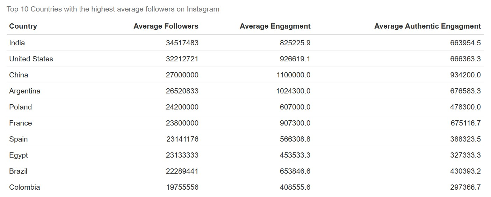
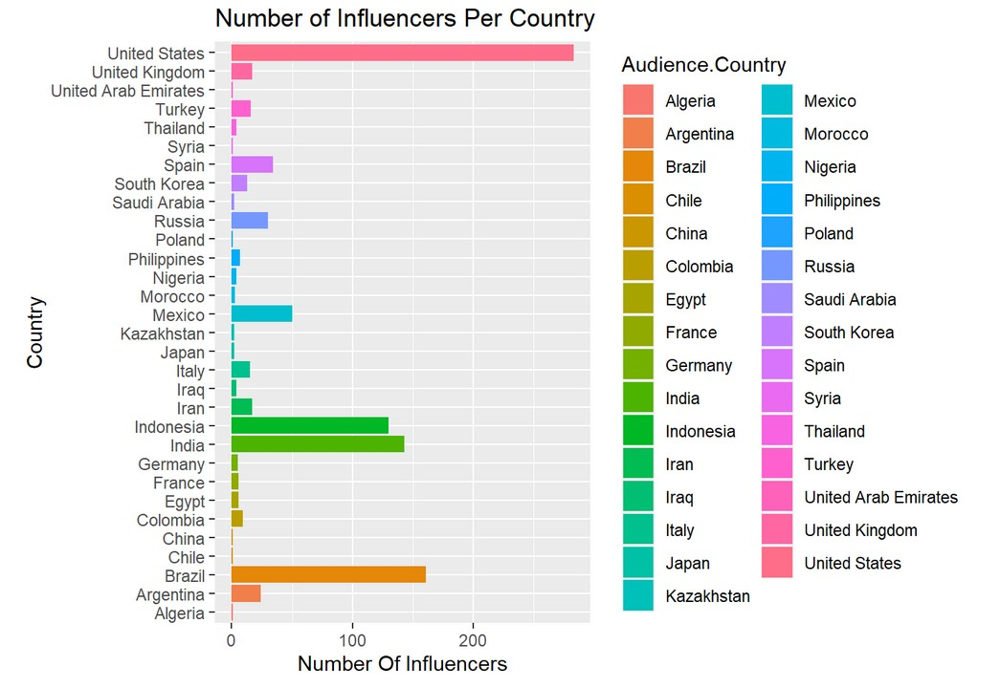

Our analysis provided key insights into influencers across the major social media platforms. The trends revealed by the dataset are helpful to understand the globalization of social media and through which influencers different audiences might be reached.

The table *Top 10 Countries with the Highest Followers on Instagram*[^1] displays follower comparisons between major countries. It is unsurprising that India has the highest average follower rate per influencer given India's large population. However, the United States has a greater average follower rate than China, which is disproportionate the countries' population sizes. These findings are consistent between the graphs throughout our analysis.

This may be a reflection of China's internet restrictions and separate social media spheres. Yet a further wrinkle lies in the authentic engagement metric. While India and the United States hover around 660,000 followers, China reaches nearly a million. It indicates that while a smaller proportion of Chinese citizens are on Instagram, these users are more deeply engaged than their counterparts in other major countries. As demonstrated by Chart 3, "Average to Authentic Engagement," a high follower count doesn't necessarily guarantee high engagement. These are valuable nuances for any company with a global perspective.

A final takeaway from the *Number of Influencers Per Country*[^2] chart is the United State's lead in influencer count. While the United States does not have the highest population, it has historically been the global hub of pop culture. It is therefore unsurprising that this influence would extend onto social media. However, whether this trend will continue is an interesting question. If the United States lost its lead in influencer count, it would be a reflection of broader social trends towards globalization.

Overall, analyzing the [Social Media Influencer Dataset](https://www.kaggle.com/datasets/ramjasmaurya/top-1000-social-media-channels) has provided an overview of the global influencer ecosystem. Whether looking at social trends, marketing strategy, or influencer diversity, this analysis creates context for the increasing prevalence of influencers in our lives.

[^1]: [Top 10 Countries with the Highest Followers on Instagram](Follower-Chart.png)
[^2]: [Number of Influencers Per Country](InfluencerPerCountry.jpg)

